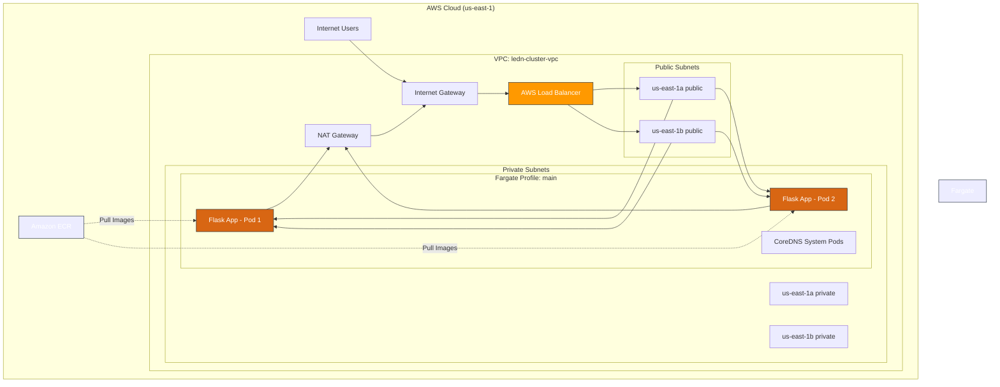

# Ledn DevOps Challenge (EKS Fargate Edition)

## 1. Project Overview
This repository contains a production-ready deployment for a Python web app on AWS EKS using Fargate (Serverless Kubernetes), managed by Terraform and GitHub Actions.

## 2. Architecture Summary
*   **Infrastructure:** EKS Cluster `ledn-cluster` running 100% on Fargate.
*   **Networking:** VPC spanning 2 AZs (us-east-1a, us-east-1b) with private subnets for workloads and public subnets for the Load Balancer.
*   **CI/CD:** GitHub Actions for automated Docker builds (ECR) and Terraform provisioning.

### Infrastructure Diagram


## 3. How to Deploy & Destroy

### Prerequisites
*   AWS CLI connected to your account.
*   Terraform installed locally.

### Step 1: Bootstrap Auth (One-time Setup)
Because GitHub Actions needs permission to access your AWS account, you must run Terraform **locally** once to set up the OpenID Connect (OIDC) provider.

1.  Edit `terraform/variables.tf` and set `github_repo` to your repository (e.g., `your-user/your-repo`).
2.  Run the initial provision:
    ```bash
    cd terraform
    terraform init
    terraform apply -auto-approve
    ```
3.  **Critical:** Copy the output value `github_actions_role_arn` from the terminal.
4.  Go to your GitHub Repository -> Settings -> Secrets and variables -> Actions.
    *   Create a New Repository Secret named `AWS_ROLE_ARN`.
    *   Paste the value you copied.

### Step 2: Automated Deployment
Now that the trust is established, simply push to the `main` branch. The GitHub Action will take over:
1.  Build and push the Docker image to ECR.
2.  Update Infrastructure via Terraform.
3.  Deploy Kubernetes manifests.

### Destroy
```bash
cd terraform
terraform destroy -auto-approve
```

## 4. The 'Ace in the Hole' (Strategic Design Choices)

> **Architecture:** EKS on Fargate was chosen to eliminate EC2 management (patching/scaling), providing a true serverless experience.
> **High Availability:** The solution uses a Multi-AZ VPC. The ALB distributes traffic across private subnets in two zones.
> **Zero Downtime:** Configured RollingUpdates with Readiness Probes ensure no traffic hits a pod until it is fully healthy.
> **Security:** Strict network isolation. Pods have no public IPs; all ingress is managed via the AWS Load Balancer Controller.

## 5. Security & Cost Optimization
*   **Cost:** Minimal Fargate sizing (0.25 vCPU) and a single NAT Gateway reduce monthly overhead.
*   **Isolation:** Application pods run exclusively in private subnets.
*   **Permissions:** IAM Roles for Service Accounts (IRSA) ensure least-privilege access.
